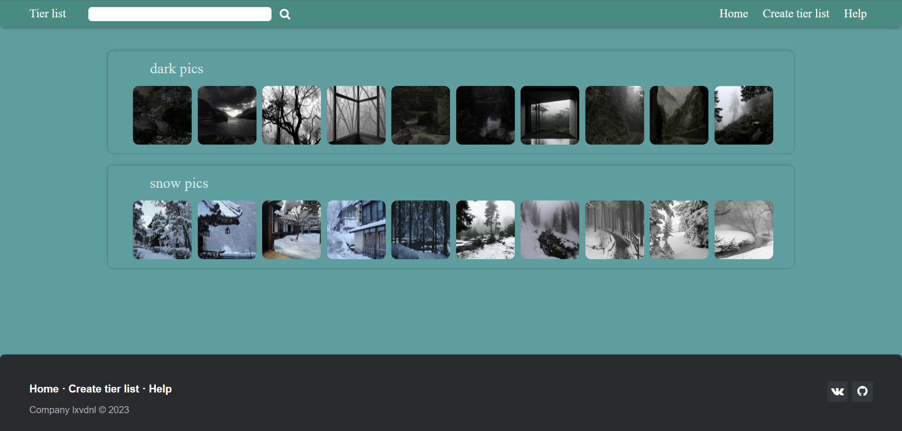

# TierList Repository
## 1. Installation
To set up the project, follow these steps:
1. Make sure you have Node.js installed.
2. Navigate to the project directory in your terminal.
3. Run the following commands in your terminal:
   ```
   git clone https://github.com/lxvdnl/TierList.git
   cd TierList
   npm install
   ```
## 2.  Run the server
To run the server use:
  ```
  node server.js
  ```  
If the server run without errors, then copy the link from the terminal and paste it into the browser search

